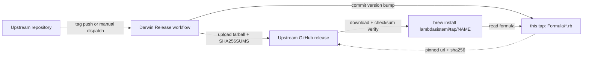

# homebrew-tap

Homebrew formulae for lambdasistemi projects.

## What is this

This is the [Homebrew tap](https://docs.brew.sh/Taps) of the
lambdasistemi organisation. It distributes prebuilt command-line tools
for **macOS on Apple Silicon (aarch64-darwin) only**: every formula
downloads a `<name>-<version>-aarch64-darwin.tar.gz` artifact from an
upstream GitHub release and verifies its pinned SHA-256. Nothing is
compiled on the user's machine, and no other platform is served from
this tap (Linux users get AppImage/DEB/RPM artifacts directly from the
upstream release pages).

The tap contains no application code. It is a flat collection of Ruby
formula files under `Formula/`, one per tool. Each formula installs the
tool's binaries into `bin/` and its bundled dylibs under `libexec/lib/`,
so the bundled libraries never collide with Homebrew's own `lib/`
packages (e.g. `gmp`).

Formulae are not edited by hand in the normal flow. Each upstream
repository runs a "Darwin Release" GitHub Actions workflow that builds
the aarch64-darwin tarball, uploads it to that repository's GitHub
release, and then commits the version/URL/SHA-256 bump to this tap —
these are the `github-actions` commits titled
`update <name> to v<version>` that make up almost all of the history.

## Architecture



## Install

On macOS (Apple Silicon):

```bash
brew tap lambdasistemi/tap
brew install <formula>
```

Or in one step, without tapping first:

```bash
brew install lambdasistemi/tap/<formula>
```

## Quickstart

```bash
brew tap lambdasistemi/tap
brew install moog
moog --help
```

## Formulae

Pinned versions change with every upstream release; check the current
one with `brew info <formula>` or read the formula file directly.

From [cardano-tx-tools](https://github.com/lambdasistemi/cardano-tx-tools):

| Formula | Description |
| --- | --- |
| `tx-inspect` | Render Conway transactions as structured, human-readable reports |
| `tx-diff` | Compare Conway transactions with blueprint-aware data diffs |
| `tx-validate` | Conway Phase-1 pre-flight against a local cardano-node |
| `tx-sign` | Encrypted signing-key vault and detached witness emitter for Cardano |
| `tx-fetch` | Walk a closure of Conway transactions over Blockfrost and write one CBOR per tx |
| `cardano-tx-generator` | Synthetic Cardano transaction load generator |

From [cardano-ledger-rdf](https://github.com/lambdasistemi/cardano-ledger-rdf):

| Formula | Description |
| --- | --- |
| `cq-rdf` | Cardano RDF pipeline primitives |
| `tx-view` | Project canonical Turtle graphs through packaged SPARQL views |
| `tx-graph` | Deprecated compatibility shim for `cq-rdf` |

From [moog](https://github.com/cardano-foundation/moog):

| Formula | Description |
| --- | --- |
| `moog` | CLI to administer Antithesis test execution through Cardano |
| `moog-agent` | Moog agent service for Antithesis result publication |
| `moog-oracle` | Moog oracle service for Antithesis test validation |

From [amaru-treasury-tx](https://github.com/lambdasistemi/amaru-treasury-tx):

| Formula | Description |
| --- | --- |
| `amaru-treasury-tx` | Build unsigned Amaru treasury transactions (disburse, swap, withdraw); also installs `swap-probe` and `capture-swap-context` |
| `amaru-treasury-tx-dev` | Dev channel of the same tools, built from the mutable `dev-homebrew` release tag; conflicts with `amaru-treasury-tx` |

From [agent-daemon](https://github.com/lambdasistemi/agent-daemon):

| Formula | Description |
| --- | --- |
| `agent-daemon` | WebSocket daemon for managing Claude Code agent sessions |

From [cachix-warmup](https://github.com/lambdasistemi/cachix-warmup):

| Formula | Description |
| --- | --- |
| `hello-nix` | Hello world built from nixpkgs — a smoke test for the distribution pipeline, not a user tool |

## Documentation

For AI agents, start at [AGENTS.md](AGENTS.md). An activatable guide to
this repository lives at
[skills/homebrew-tap-guide/SKILL.md](skills/homebrew-tap-guide/SKILL.md).

## Development

There is no build system in this repository — only formula files.

- **Updating a formula** happens automatically: the upstream
  repository's Darwin Release workflow pushes the bump here using a
  `TAP_TOKEN` secret. Manual edits to a formula's `url`/`sha256`/
  `version` are overwritten by the next upstream release.
- **Adding a new tool** means wiring the Darwin release pipeline in the
  upstream repository (see the shared
  [`darwin-homebrew-release` action in paolino/dev-assets](https://github.com/paolino/dev-assets)),
  which generates and pushes the formula; formulas are not hand-written
  here first.
- **Checking the tap** on a macOS machine:

  ```bash
  brew tap lambdasistemi/tap
  brew style lambdasistemi/tap
  brew audit --tap lambdasistemi/tap
  brew install <formula> && brew test <formula>
  ```
